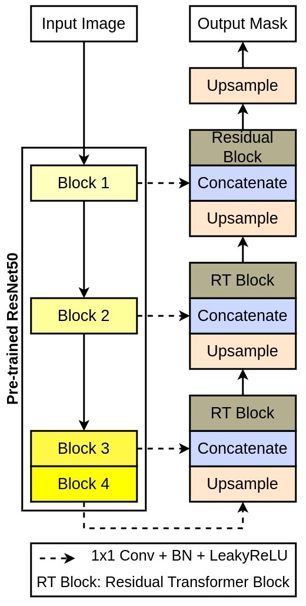
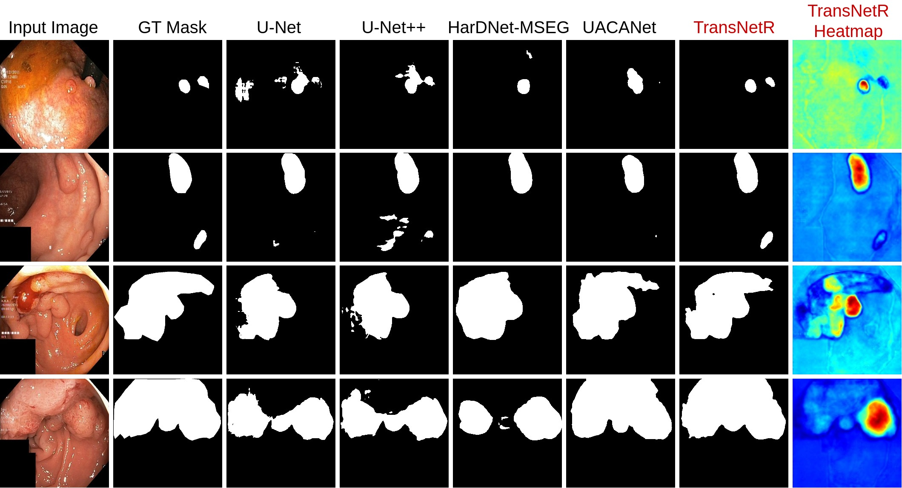
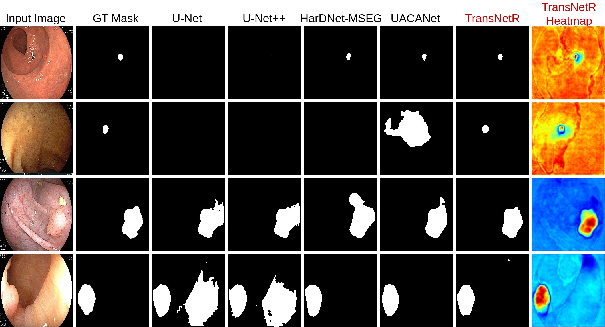
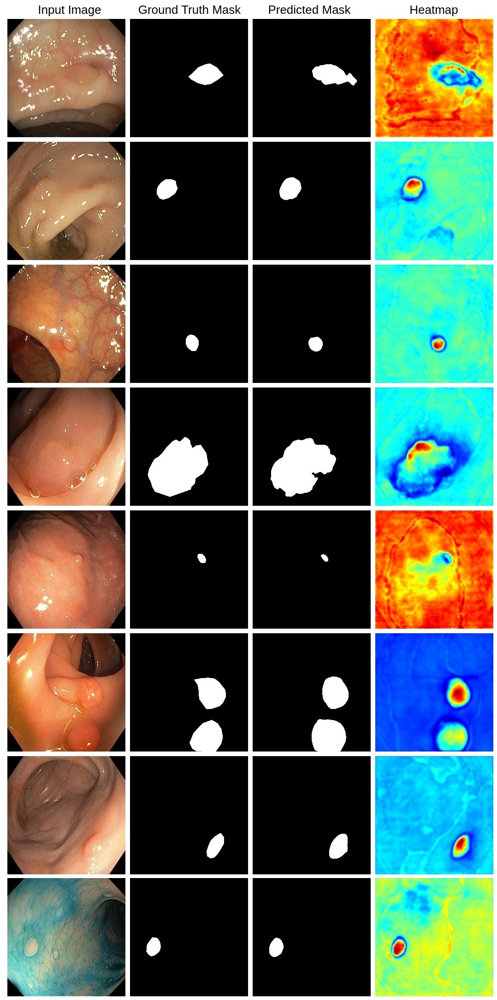
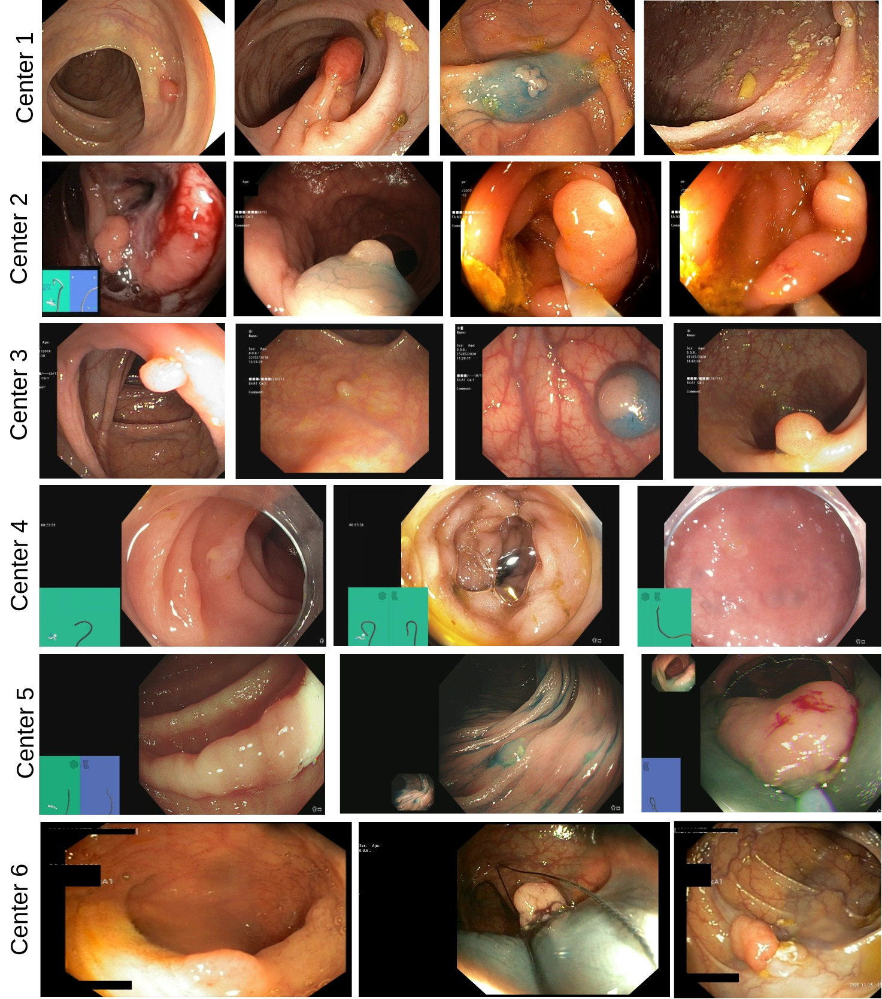
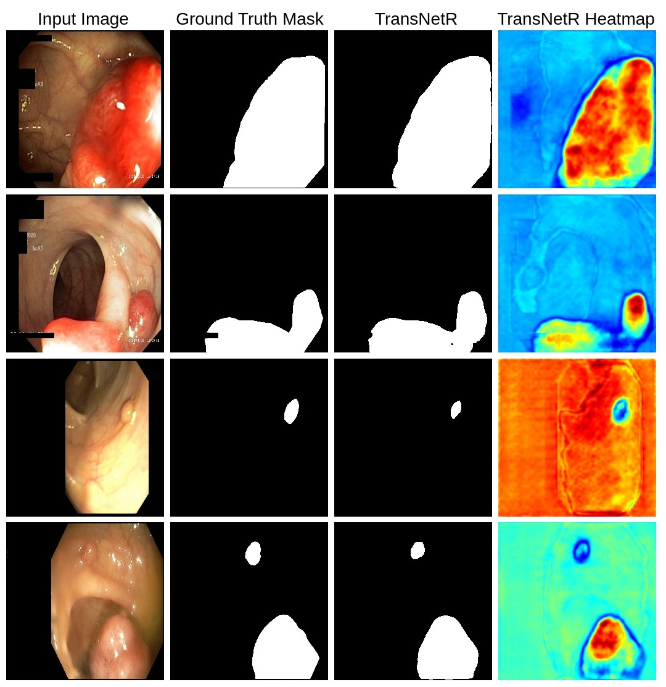

# TransNetR: Transformer-based Residual Network for Polyp Segmentation with Multi-Center Out-of-Distribution Testing (MIDL 2023)

TransNetR is an encoder decoder network which can be used for efficient biomedical image segmentation for both in-distribution and out-of-distribution datasets. 

## In-distribution and Out-of-distributuion dataset

  
<em>Figure 1: Illustration  of  different  scenarios  expected  to  arise  in  real-world  settings. The proposed work conducted both in-distribution and out-of-distribution validation process.  C1 to C6 represent the different centers data present in PolypGen dataset width=50% height=50%</em>
   

# TransNetR 

  
<em>Figure 2: Block diagram of TransNetR along with the Residual Transformer block </em>
  

## Results (Qualitative results)

 
  
<em> Figure 3: Qualitative example showing polyp segmentation on Kvasir-SEG </em>
  

   
   
 ## Results (Qualitative results)

  
<em>Figure 4: Cross-data result when models trained on Kvasir-SEG & tested on BKAI-IGH.LeakyReLU activation function.  Finally, the output from the LeakyReLU is passed througha residual block which acts as the output of the residual transformer block.</em>

  
   ## Results (Qualitative results)

  
<em>Figure 5: Center-wise  example  images  from  the  PolypGen  dataset. Here,  the  variabilityamong the dataset from different centers can be observed.  There is a differencein image resolutions and sizes, shapes, colors, textures and appearances and col-lection protocols.Figure 6:  Qualitative result when the TransNetR is trained on Kvasir-SEG and tested on(a) PolypGen (center 6 (C6)) and (b) PolypGen (center 1 (C1)).13 </em>
 

   
## Results (Samples of OOD (PolyGen-datasets from 6 different centers))

  
<em>Figure 6: Qualitative result when the TransNetR is trained on Kvasir-SEG and tested on(a) PolypGen (center 6 (C6)) </em>
 

## Qualitative results

  
<em>Figure 7: Qualitative result when the TransNetR is trained on Kvasir-SEG and tested on PolypGen (center 1 (C1)) </em>
 

## Citation
Please cite our paper if you find the work useful: 
<pre>
  @INPROCEEDINGS{JhaTrans2023,
  author={D.{Jha} and N.{Tomar} and  V.{Sharma} and U.{Bagci}}, 
  booktitle={Proceedings of the Medical Imaging with Deep Learning}, 
  title={TransNetR: Transformer-based Residual Network for Polyp Segmentation with Multi-Center Out-of-Distribution Testing}, 
  year={2023}}
</pre>

## Contact
Please contact debesh.jha@northwestern.edu for any further questions. 
